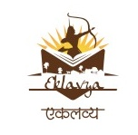
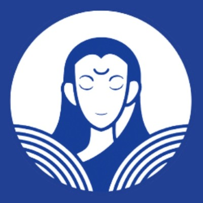

# {background-image="images/oxford.png" background-size="contain" background-position="right"  background-color="#003366"}

[Jai Bhim!]{.theme-cursive style="font-size: 3em; color:white"}

::: footer
Comment on 2 Sep 2026; [Link of post](https://www.linkedin.com/posts/oxforduni_oxford-after-the-rain-instagram-activity-7500907670200246273--44N?utm_source=share&utm_medium=member_desktop&rcm=ACoAABYsZm8BIUjtOPD8iuzkFH9ksHCDSk4WPjs)
:::

## Welcome {.centering}

 

:::: {.layout-grid}

::: {.col}
::: {.card}

Presenter

### **Dr. Ajay Koli** $\cdot$ [](https://www.linkedin.com/in/ajay-kumar-koli/)
::: 
:::

::: {.col}

{width="60%"}

::: {.r-fit-text .fragment}
Introductions (5 min)  
About SARA (20-25 min)  
Discussion (45-50 min)  
Insights (10 min)
:::

:::

::: {.col}
::: {.card}

Moderator

###  **Dr. Cecilia** $\cdot$ [](https://www.linkedin.com/in/cecilia-baldoni/)
:::
::: 

::::

#  Introduction {background-image="images/sara-logo-medium.png" background-size="15%" background-position="50% 25%" visibility="hidden"}

## {.centering .center}

::: {.columns}

::: {.column width="35%"}

{fig-alt="Sara's headshot" fig-align="center" width=250px style="border-radius: 50%;"}

#### Savitribai Phule (1831-1897) 🪷🙏🏽🪷

:::

::: {.column width="20%"}

 

:::

::: {.column width="35%"}

{fig-alt="Sara's headshot" fig-align="center" width=250px style="border-radius: 50%;"}

#### Ramabai Ambedkar (1898-1935) 🪷🙏🏽🪷

:::

[**Savitribai Ramabai (SARA) Institute of Data Science, Sonipat**]{.r-fit-text}

:::

::: footer
Images are AI generated
:::
---

## SARA Education Trust {background-image="images/trustees.png" background-size="50%" background-position="109% 50%"}

::: {.columns}

::: {.column}

::: {.nonincremental}

> Building open-access educational space for first-generation learners.

- 9 community members founded SARA in Apr 2023.

- Free^1^, open-source and inclusive education.

- Date of Trust Reg.: 02 Mar 2024.

- Around 300 students taught.

::: aside
^1^No tuition fee. Students pay for their food and accommodation.
:::

:::

:::

::: {.column}

:::

:::

# SARA Data Trainings {background-image="images/sahu-laptop.png, https://images.unsplash.com/vector-1773253588344-b80c5db0b204?q=80&w=1800&auto=format&fit=crop&ixlib=rb-4.1.0&ixid=M3wxMjA3fDB8MHxwaG90by1wYWdlfHx8fGVufDB8fHx8fA%3D%3D" background-size="27%" background-position="85% 50%" background-color="#003366"}

::: footer
<a href="https://unsplash.com/illustrations/colorful-wildflowers-blooming-against-a-white-background-0JYOM33b8Yw?utm_source=unsplash&utm_medium=referral&utm_content=creditCopyText">Illustration</a> by <a href="https://unsplash.com/@pragatichoudhari/illustrations?utm_source=unsplash&utm_medium=referral&utm_content=creditCopyText">Pragati Choudhari</a> on <a href="https://unsplash.com/illustrations?utm_source=unsplash&utm_medium=referral&utm_content=creditCopyText">Unsplash</a>

<a href="https://unsplash.com/illustrations/a-cartoon-triangle-character-using-a-laptop-NolacJp8Xqg?utm_source=unsplash&utm_medium=referral&utm_content=creditCopyText">Illustration</a> by <a href="https://unsplash.com/@aditya_sahu_lab/illustrations?utm_source=unsplash&utm_medium=referral&utm_content=creditCopyText">Aditya Sahu</a> on <a href="https://unsplash.com/illustrations?utm_source=unsplash&utm_medium=referral&utm_content=creditCopyText">Unsplash</a>
:::
---

## SARA Data Schools

 
 

- 07 Non-profit^1^ schools held 

- Overcome the fear of coding & numbers

- Offline, PhD students, reputed pro bono speakers

::: {.aside}
^1^ Participants pay only for their food and accommodation.
:::
---

## SARA Data Schools {background-color="#212121"}

::: {.panel-tabset}

### Summer School

::: {#fig-summer layout-ncol=2 layout-valign="bottom"}

{#fig-surus}

{#fig-hanno}

Participants of the SARA Summer Schools "R for Researchers"
:::

### Winter School 

::: {#fig-winter layout-ncol=2 layout-valign="bottom"}

{#fig-surus}

{#fig-hanno}

Participants of the SARA Winter Schools "Statistics using R"
:::

### Bootcamp

🎉Completely free for all women in celebration of International Women’s Day

::: {#fig-bootcamp layout-ncol=2 layout-valign="bottom"}

{#fig-surus}

{#fig-hanno}

Participants of the SARA Coding Bootcamps "Publish using Quarto"

:::

::: 
---

## 3rd SARA Summer School {background-image="images/3sss.png" background-size="40%" background-position="100% 50%" background-color="#212121"}

> "R for Researchers" 22-26 Jul 2026

::: {.columns}

::: {.column width="60%"}

 

- 10 participants attended.

- 07 participants received full scholarship

:::

::: {.column}

:::

:::
---

## SARA Guest Speakers {background-image="images/guest-speakers.png" background-size="contain" background-position="right"}

> Pro bono speakers during 2025-26

 

::: {.columns}

::: {.column width="50%"}

{fig-align="left"}

:::

::: {.column}

:::

:::
---

## 🔊🔊🔊3rd SARA Winter School {background-image="images/3sws.png" background-size="40%" background-position="100% 50%"}

> "Statistics using R" in 20-24 Nov 2026

::: {.columns}

::: {.nonincremental}

::: {.column width="60%"}

- Day 1: R, RStudio & descriptive statistics

- Day 2: Date Visualization

- Day 3: Probability & Sampling

- Day 4: Inferential Statistics Hypothesis testing

- Day 5: Correlation and Regression

:::
:::

::: {.column}

:::

:::

## 🚨Help SARA! {background-image="images/help.png" background-size="20%" background-position="85% 50%"}

 
 
 

::: {.columns}

::: {.column width=60%}

1. What more do we need to add in our data school modules?

1. Should SARA approach other organisations to get sponsorship or donation? Can you help with this?

:::

::: {.column}

:::

:::

::: {.footer}
<a href="https://unsplash.com/illustrations/two-people-holding-a-blue-heart-in-their-hands-pJwFA-hi-Jc?utm_source=unsplash&utm_medium=referral&utm_content=creditCopyText">Illustration</a> by <a href="https://unsplash.com/@roundicons/illustrations?utm_source=unsplash&utm_medium=referral&utm_content=creditCopyText">Round Icons</a> on <a href="https://unsplash.com/illustrations?utm_source=unsplash&utm_medium=referral&utm_content=creditCopyText">Unsplash</a>
:::

# SARA Bridge Education {background-image="images/sahu-notebook.png, https://images.unsplash.com/vector-1773253588344-b80c5db0b204?q=80&w=1800&auto=format&fit=crop&ixlib=rb-4.1.0&ixid=M3wxMjA3fDB8MHxwaG90by1wYWdlfHx8fGVufDB8fHx8fA%3D%3D" background-size="27%" background-position="85% 50%" background-color="#003366"}

::: footer
<a href="https://unsplash.com/illustrations/a-cartoon-triangle-character-using-a-laptop-NolacJp8Xqg?utm_source=unsplash&utm_medium=referral&utm_content=creditCopyText">Illustration</a> by <a href="https://unsplash.com/@aditya_sahu_lab/illustrations?utm_source=unsplash&utm_medium=referral&utm_content=creditCopyText">Aditya Sahu</a> on <a href="https://unsplash.com/illustrations?utm_source=unsplash&utm_medium=referral&utm_content=creditCopyText">Unsplash</a>
:::

## Bridge Education {background-image="images/bridge-course.png" background-position="right" background-size="contain"}

> Level 1 $\cdot$ Free $\cdot$  Online $\cdot$ Open to all

::: {.nonincremental}
- For first-generation learners.

- Essential subjects like: 
  - Maths
  - Science
  - Social Science
  - English language
  - General Knowledge etc.

::: {.footer}
[ SARA YouTube Channel](https://www.youtube.com/@SARADataScience)
:::

:::
---

## SARA Book Club {background-image="images/book-donation.png" background-size="contain" background-position="right" background-color="#212121"}

> 26/40 Books for Bridge Course Level 1

 



[ Sign-up for pro-bono teaching](https://sara-edu.netlify.app/book-club/books-donation/sara_book_donations)

---

##  Up Coming SARA Projects

::: {.panel-tabset}

## 2027 Bridge Course Level 1 

> L1 = Foundation (6-8 content) $\cdot$ L2 = (9 & 10 content) $\cdot$ L3 = (11 & 12 content) 

- From Sep 2027, offline three months L1 foundation course at SARA, Dr. Ambedkar Bhawan, Sonipat.

- 100 students (50 female) priority admission for marginal communities & women.

- Plan funds to provide accommodation and food for 100 days.

- Need pro bono teachers, ideal would be offline.

- Prepare a detailed teaching schedule.

## 2028 Internships

 

- Data & research related summer & winter internships

- Need more planning how SARA can have its own project.

## 2029 Conference

> 3 Jan Mata Savitribai's Birth Anniversary 

- Inviting scholars to present papers.

- Inviting young students to interact with the scholars.

- Award budding scholars from marginalised communities.

:::

## SARA's 1st own Space {background-image="images/oxford.png" background-size="contain" background-position="right" background-color="#212121"}

- Land at least 500 Gaj (approx 5000 Sq foot) in Delhi NCR

- 1 auditorium for at least 100 students

- Two dormitories (each with 50 capacity beds)

- Guest rooms, meeting rooms, office roooms

- Mess with kitchen facility

## 🚨Help SARA! {background-image="images/help.png" background-size="20%" background-position="85% 50%"}

 
 

::: {.columns}

::: {.column width=65%}

1. Whether to conduct bridge course classes live on YouTube or first on zoom and then later upload on YouTube?

1. What should be the prefered language for these online classes?

1. Would you like to teach or know anyone who might be interested in pro bono teaching?

:::

::: {.column}

:::

:::

::: {.footer}
<a href="https://unsplash.com/illustrations/two-people-holding-a-blue-heart-in-their-hands-pJwFA-hi-Jc?utm_source=unsplash&utm_medium=referral&utm_content=creditCopyText">Illustration</a> by <a href="https://unsplash.com/@roundicons/illustrations?utm_source=unsplash&utm_medium=referral&utm_content=creditCopyText">Round Icons</a> on <a href="https://unsplash.com/illustrations?utm_source=unsplash&utm_medium=referral&utm_content=creditCopyText">Unsplash</a>
:::

# SARA Finance {background-image="images/sahu-safe.png, https://images.unsplash.com/vector-1773253588344-b80c5db0b204?q=80&w=1800&auto=format&fit=crop&ixlib=rb-4.1.0&ixid=M3wxMjA3fDB8MHxwaG90by1wYWdlfHx8fGVufDB8fHx8fA%3D%3D" background-size="27%" background-position="80% 50%" background-color="#003366"}

::: footer
<a href="https://unsplash.com/illustrations/a-cartoon-triangle-character-using-a-laptop-NolacJp8Xqg?utm_source=unsplash&utm_medium=referral&utm_content=creditCopyText">Illustration</a> by <a href="https://unsplash.com/@aditya_sahu_lab/illustrations?utm_source=unsplash&utm_medium=referral&utm_content=creditCopyText">Aditya Sahu</a> on <a href="https://unsplash.com/illustrations?utm_source=unsplash&utm_medium=referral&utm_content=creditCopyText">Unsplash</a>
:::

## SARA Education Trust

 
 

- SARA Trust registered in New Delhi on Date: `02 Mar 2024`

- Permanent Account Number (PAN) Card: `ABJTS0156P`

- Trust Bank Account: SBI Sonipat, HR

## Previous IT Returns {background-color="#212121"}

> ❤️Community members are the main donors $\cdot$ 99% online transactions

::: {.centering}
::: {layout-ncol="2"}

{width="70%"}

{width="70%"}

:::
:::

## SARA Account {background-image="images/blankets.png" background-size="50%" background-position="109% 50%"}

> Apr-Sep 2026

 

::: {.columns}

::: {.column}

:::{.finance-table}
| Category | Amount |
|---|--------------|
| Donations | [₹2,00,000]{.amount-positive} approx. |
| Expenses  | [₹2,50,000]{.amount-negative} approx. |
| Balance   | ₹1,01,200 approx. |
:::

::: {.aside}
- Amount carried from 2025-26: ₹1,52,611
- Dr. Ajay Kumar Koli's per month salary ₹15,000.
- On 6 Jul 2026, SARA's 12A & 80G Applications were submitted by a CA on the Income Tax department website.
:::

:::

::: {.column}

:::

:::

## Donate to SARA {background-image="images/upi-sara.png" background-position="right" background-size="contain"}

::: {.columns}

::: {.column}

> One rupee. One brick.

 

::: {.nonincremental}

- Account number: `42920911856`

- Acc. name: SARA Education Trust

- Bank name: State Bank of India

- IFSC code: `SBIN0000721`

:::

:::

::: {.column}

:::

:::

## 🚨Help SARA! {background-image="images/help.png" background-size="20%" background-position="85% 50%"}

 
 
 

::: {.columns}

::: {.column width=65%}

1. Should SARA buy its own land to build its own space? What else we need to be thinking about?

1. Should SARA annually confer an award on the occasion of Mata Savitribai birthday? 

:::

::: {.column}

:::

:::

::: {.footer}
<a href="https://unsplash.com/illustrations/two-people-holding-a-blue-heart-in-their-hands-pJwFA-hi-Jc?utm_source=unsplash&utm_medium=referral&utm_content=creditCopyText">Illustration</a> by <a href="https://unsplash.com/@roundicons/illustrations?utm_source=unsplash&utm_medium=referral&utm_content=creditCopyText">Round Icons</a> on <a href="https://unsplash.com/illustrations?utm_source=unsplash&utm_medium=referral&utm_content=creditCopyText">Unsplash</a>
:::

# SARA Community {background-image="images/sahu-community.png, https://images.unsplash.com/vector-1773253588344-b80c5db0b204?q=80&w=1800&auto=format&fit=crop&ixlib=rb-4.1.0&ixid=M3wxMjA3fDB8MHxwaG90by1wYWdlfHx8fGVufDB8fHx8fA%3D%3D" background-size="30%" background-position="80% 50%" background-color="#003366"}

::: footer
<a href="https://unsplash.com/illustrations/a-cartoon-triangle-character-using-a-laptop-NolacJp8Xqg?utm_source=unsplash&utm_medium=referral&utm_content=creditCopyText">Illustration</a> by <a href="https://unsplash.com/@aditya_sahu_lab/illustrations?utm_source=unsplash&utm_medium=referral&utm_content=creditCopyText">Aditya Sahu</a> on <a href="https://unsplash.com/illustrations?utm_source=unsplash&utm_medium=referral&utm_content=creditCopyText">Unsplash</a>
:::

## SARA is similar but

 
 

::: {.centering}
::: {layout-ncol="3"}

  

  

{width="1.25in"}    

:::
:::

. . .

> [SARA's focus is coding & AI for Babasaheb's children.]{.r-fit-text}

[data justice, responsible AI, exclusionary AI, data colonialism, automated inequality, algorithmic discrimination]{.r-fit-text}

## Data/AI Justice Books

## 

 

::: {.centering}

{width=45%}

[The Ambedkar Educational Society Sonipat, HR]{.r-fit-text}

[Mr. Satyawan Bhatia (ex-President) $\cdot$ Mr. Rajesh Kataria (President)]{.amount-positive}

:::

## Sircle 

> SARA Jai Bhim Circle

 
 

::: {.nonincremental}

- Quarterly online community meet-up.

- To share success & receive guidance from community members.

:::

## SARA Social Media {background-image="images/whatsapp.jpeg" background-position="right" background-size="contain"}

> Pls follow & share

::: {.columns}

::: {.column width="60%" .r-fit-text}

[](https://twitter.com/sara_institute) Twitter with `1552` people 

[](https://www.youtube.com/@SARADataScience) YouTube with `+890` people

[](https://whatsapp.com/channel/0029Va4r7rGLCoWycMwThl2J) WhatsApp Channel with `+844` people

[](https://www.linkedin.com/company/sara-institute/) LinkedIn with `+600` people

[](https://www.facebook.com/profile.php?id=61564043738390) Facebook with `+97` people

[](https://bsky.app/profile/sarainstitute.bsky.social) Bluesky with with `+63` people

[](https://www.instagram.com/sara_data_sci/) Instagram with `+57` people

[](https://github.com/sara-edu) GitHub with `+16` people

:::

::: {.column}

:::

:::

::: {.aside}
updated on 10 Sept 2026
:::

## Contact SARA {background-image="images/sara-logo-medium.png" background-size="20%" background-position="90% 50%"}

::: {.columns }

::: {.column width="70%"}
::: {.r-fit-text}
** Address:** 
SARA Institute   
Dr. Ambedkar Bhavan, Near Dayanand Hospital            
Kakroi Road, Sonipat, Haryana - 131001, India       
Google Map Link: <https://maps.app.goo.gl/d9S6a3pEFNXhnJGN6>

 

** Phone:** +91 925 315 2024     
** Email:** [sara.institute.info@gmail.com](mailto:sara.institute.info@gmail.com)  
** Website:** <https://sara-edu.netlify.app/>

:::
:::

::: {.column width="25%" .center}
:::
:::

::: aside

[](https://bsky.app/profile/sarainstitute.bsky.social) &nbsp; [](https://github.com/sara-edu) &nbsp; [](https://www.instagram.com/sara_data_sci/) &nbsp; [](https://twitter.com/sara_institute) &nbsp; [](https://www.facebook.com/profile.php?id=61564043738390) &nbsp; [](https://www.youtube.com/@SARADataScience) &nbsp; [](https://www.linkedin.com/company/sara-institute/) &nbsp; [](https://whatsapp.com/channel/0029Va4r7rGLCoWycMwThl2J)

:::

# {background-image="https://images.unsplash.com/vector-1773253588344-b80c5db0b204?q=80&w=1800&auto=format&fit=crop&ixlib=rb-4.1.0&ixid=M3wxMjA3fDB8MHxwaG90by1wYWdlfHx8fGVufDB8fHx8fA%3D%3D" background-opacity="25%" background-size="cover" background-position="bottom -525px left -1px"}

::: centering
[Thank you!]{.theme-cursive style="font-size: 3em;"}

**SARA Jai Bhim Circle 3rd Quarter Meeting will be on Sun 03 Jan 2027**
:::

::: footer
Slides are prepared with ❤️ using open-source tools [Positron](https://positron.posit.co/download.html) & [Quarto](https://quarto.org/) from [Posit](https://posit.co/)
:::

# Let's Discuss! {background-image="https://media2.giphy.com/media/v1.Y2lkPTc5MGI3NjExeXEzb3loMDJ3azQ2cWtyOWZpYTR5aWpoYWR2NzRxMGxvYWxldHRndyZlcD12MV9pbnRlcm5hbF9naWZfYnlfaWQmY3Q9Zw/nY72ifeAVJBXZdeXPu/giphy.gif" background-size="40%" background-position="95% 50%" background-color="#212121"}

No question is silly, no answer is wrong.

## Question 1/8

 
 
 

[What else should be added to our Data School curriculum?]{.r-fit-text}

## Question 2/8

 
 
 

[Should SARA approach other organizations for sponsorships?]{.r-fit-text}

## Question 3/8

 
 
 

[Should Bridge Course classes be live-streamed on YouTube directly,  or held on Zoom first and uploaded to YouTube afterward?]{.r-fit-text}

## Question 4/8

 
 
 

[What language should be used for these online classes?]{.r-fit-text}

## Question 5/8

 
 
 

[Would you be interested in teaching pro bono,  or do you know someone who might be?]{.r-fit-text}

## Question 6/8

 
 
 

[Should SARA buy its own land to build a permanent space?]{.r-fit-text}

[What else should SARA be thinking about (as an organization)?]{.r-fit-text}

## Question 7/8

 
 
 

[Should SARA give an annual award in  honor of Savitribai Phule's birthday?]{.r-fit-text}

## Question 8/8

 
 
 

[What's the best way for SARA to keep supporters updated?]{.r-fit-text}

