## 

 

::: {.columns}

::: {.column width="50%"}

[Jai Bhim!]{.theme-cursive .r-fit-text}

  <figure class="round-figure">
    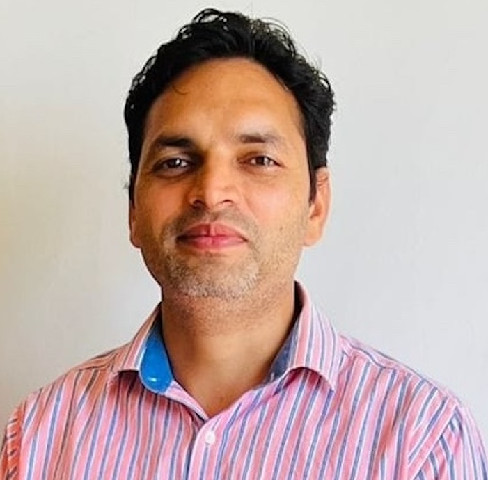
    <figcaption><b>Dr. Ajay (Presenter)</b> Founder & Director, SARA</figcaption>
  </figure>
  
  <figure class="round-figure">
    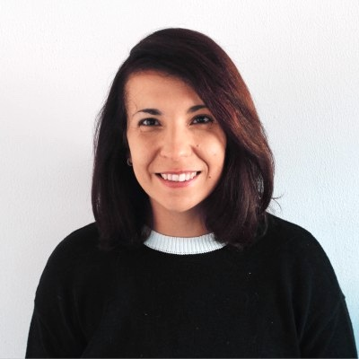
    <figcaption><b>Dr. Cecilia (Moderator)</b> SARA Volunteer, Germany</figcaption>
  </figure>

:::

::: {.column width="10%"}

:::

::: {.column width="40%"}

::: {.fragment}

  <figure class="round-figure">
    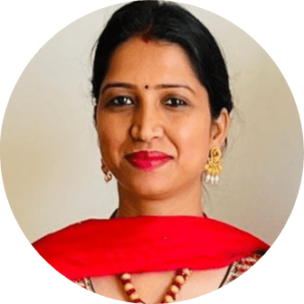
    <figcaption><b>Dr. Kiran Lata</b> Director, SARA (Apr 2023 - Mar 2026)</figcaption>
  </figure>

------

::: 

::: {.fragment}

1. [Introductions (5 min)]{.rn-fragment}  
1. [About SARA (20-25 min)]{.rn-fragment}  
1. [Discussion (45-50 min)]{.rn-fragment}  
1. [Insights (10 min)]{.rn-fragment}

:::

:::

:::

# {background-image="images/oxford.png" background-size="contain" background-position="right"  visibility="hidden"}

::: footer
Comment on 2 Sep 2026; [Link of post](https://www.linkedin.com/posts/oxforduni_oxford-after-the-rain-instagram-activity-7500907670200246273--44N?utm_source=share&utm_medium=member_desktop&rcm=ACoAABYsZm8BIUjtOPD8iuzkFH9ksHCDSk4WPjs)
:::

## Welcome {.centering visibility="hidden"}

 

:::: {.layout-grid}

::: {.col}
::: {.card}

Presenter

### **Dr. Ajay Koli** $\cdot$ [](https://www.linkedin.com/in/ajay-kumar-koli/)
::: 
:::

::: {.col}

{width="60%"}

::: {.amount-positive}
Introductions (5 min)  
About SARA (20-25 min)  
Discussion (45-50 min)  
Insights (10 min)
:::

:::

::: {.col}
::: {.card}

Moderator

###  **Dr. Cecilia** $\cdot$ [](https://www.linkedin.com/in/cecilia-baldoni/)
:::
::: 

::::

##  Introduction {background-image="images/sara-logo-medium.png" background-size="15%" background-position="50% 25%" visibility="hidden"}

## {.centering}

 

::: {.columns}

::: {.column width="35%"}

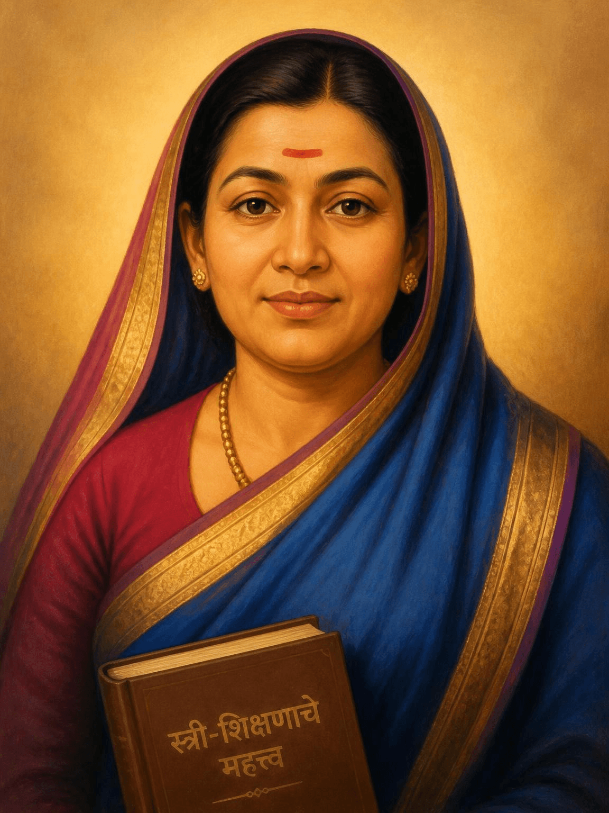{fig-alt="Sara's headshot" fig-align="center" width=250px style="border-radius: 50%;"}

#### Savitribai Phule (1831-1897) 🪷🙏🏽🪷

:::

::: {.column width="20%"}

 

:::

::: {.column width="35%"}

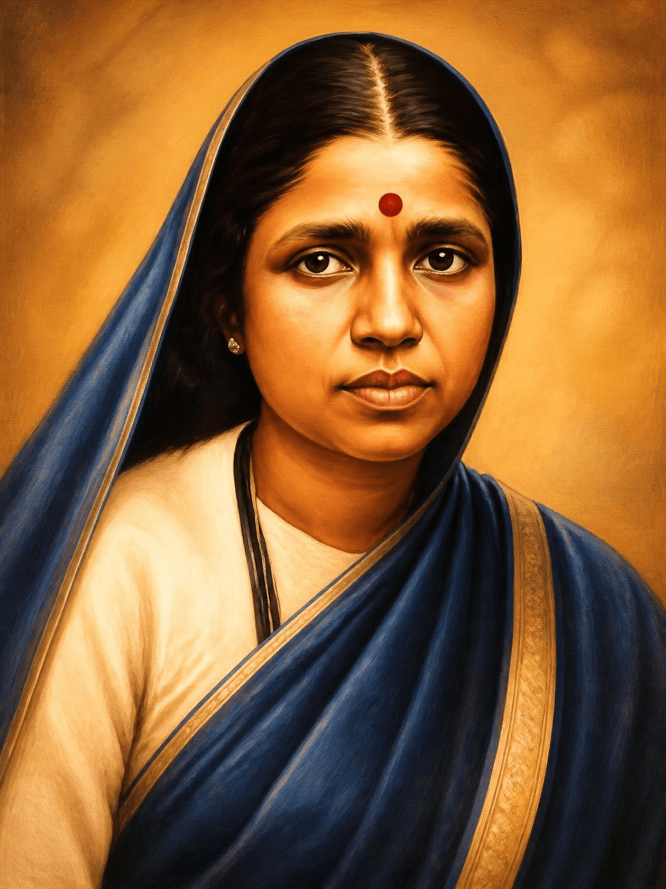{fig-alt="Sara's headshot" fig-align="center" width=250px style="border-radius: 50%;"}

#### Ramabai Ambedkar (1898-1935) 🪷🙏🏽🪷

:::

[**Savitribai Ramabai (SARA) Institute of Data Science, Sonipat**]{.r-fit-text}

:::

::: footer
AI images
:::
---

## SARA Education Trust {background-image="images/trustees.png" background-size="40%" background-position="100% 50%"}

::: {.columns}

::: {.column}

::: {.nonincremental}

> Education for everyone

 

- 05 Apr 2023: First class of SARA.

- 02 Mar 2024: Trust registered in Delhi.

- Around 300 students benefited.

:::

:::

::: {.column}

:::

:::
---

## Free Education at SARA {.centering}

 

:::: {.layout-grid}

::: {.col}

{width="60%"}

### English & Computer

:::

::: {.col}

{width="60%"}

### **Data & Research**

:::

::: {.col}

{width="60%"}

### Online Book Club

::: 

::::

::: footer
<a href="https://unsplash.com/illustrations/three-friends-taking-selfies-with-phones-oLTqZPW94DQ?utm_source=unsplash&utm_medium=referral&utm_content=creditCopyText">Illustrations</a> by <a href="https://unsplash.com/@kertiaa/illustrations?utm_source=unsplash&utm_medium=referral&utm_content=creditCopyText">Muhammad Afandi</a> on <a href="https://unsplash.com/illustrations?utm_source=unsplash&utm_medium=referral&utm_content=creditCopyText">Unsplash</a>
:::

# Data Trainings & Research Methods {background-image="images/sahu-laptop.png" background-size="27%" background-position="90% 50%" background-color="#0F766E"} 

::: footer
<a href="https://unsplash.com/illustrations/a-cartoon-triangle-character-using-a-laptop-NolacJp8Xqg?utm_source=unsplash&utm_medium=referral&utm_content=creditCopyText">Illustration</a> by <a href="https://unsplash.com/@aditya_sahu_lab/illustrations?utm_source=unsplash&utm_medium=referral&utm_content=creditCopyText">Aditya Sahu</a> on <a href="https://unsplash.com/illustrations?utm_source=unsplash&utm_medium=referral&utm_content=creditCopyText">Unsplash</a>
:::
---

## Data & Research Trainings

> To overcome the fear of coding & numbers

 

- 07 Non-profit^1^ trainings held with +100 participants (female 60%).

- 5 days, offline, in Dr. Ambedkar Bhawan, Sonipat (HR).

- Majority PhD students, first time coders, 99% from marginalised community.

- Invited international pro bono guest speakers.

::: {.aside}
^1^ Participants pay only for their food and accommodation.
:::
---

## SARA Data Schools {background-color="cream"}

::: {.panel-tabset}

### July Summer School 

::: {#fig-summer layout-ncol=2 layout-valign="bottom"}

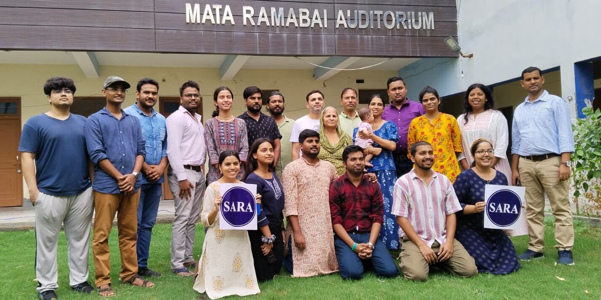{#fig-surus}

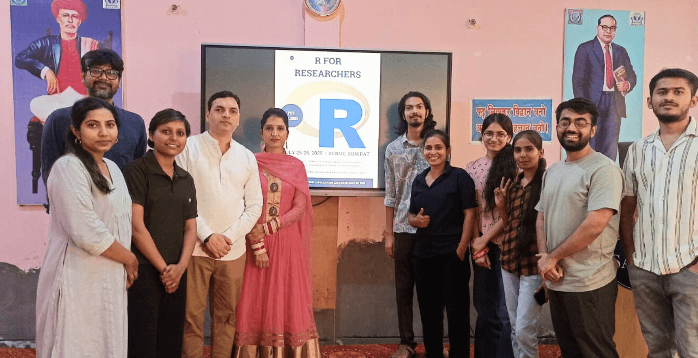{#fig-hanno}

Participants of the SARA Summer Schools "R for Researchers"
:::

### December Winter School

::: {#fig-winter layout-ncol=2 layout-valign="bottom"}

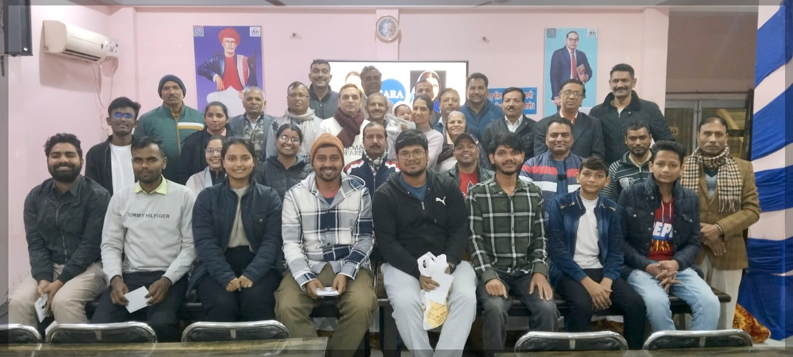{#fig-surus}

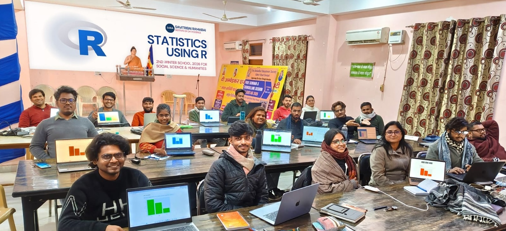{#fig-hanno}

Participants of the SARA Winter Schools "Statistics using R"
:::

### March Coding Bootcamp

🎉 Completely free for all women in celebration of *International Women’s Day*

::: {#fig-bootcamp layout-ncol=2 layout-valign="bottom"}

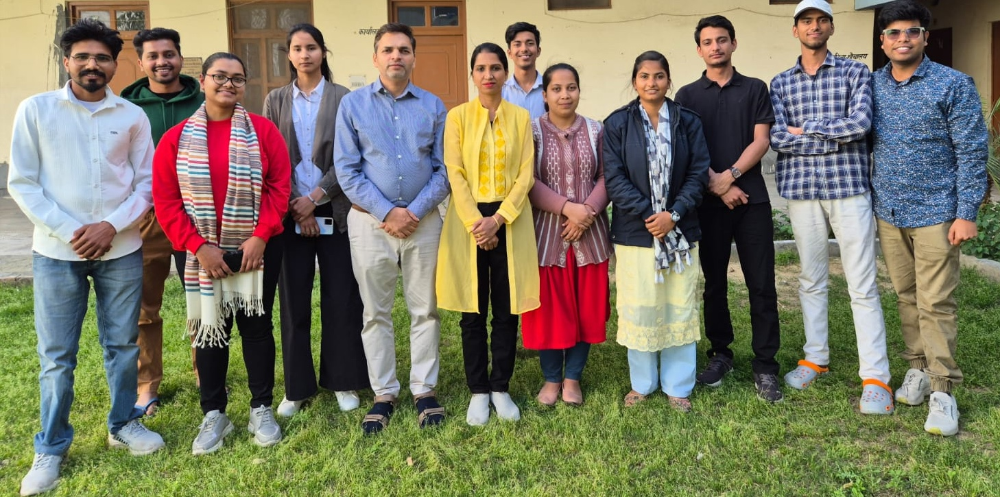{#fig-surus}

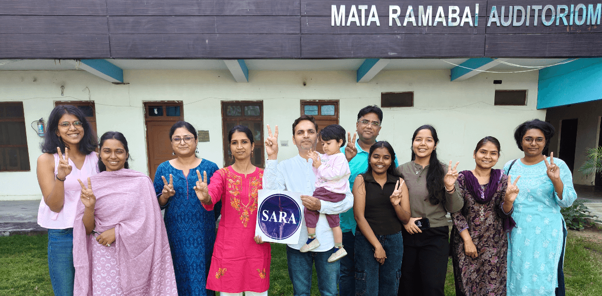{#fig-hanno}

Participants of the SARA Coding Bootcamps "Publish using Quarto"

:::

::: 
---

## 3rd SARA Summer School {background-color="cream"}

> "R for Researchers", 22-26 Jul 2026

::: {.panel-tabset}

## Participants

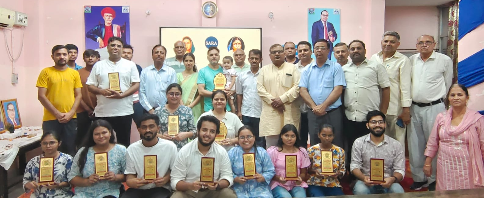{width="75%"}

## Guest speakers

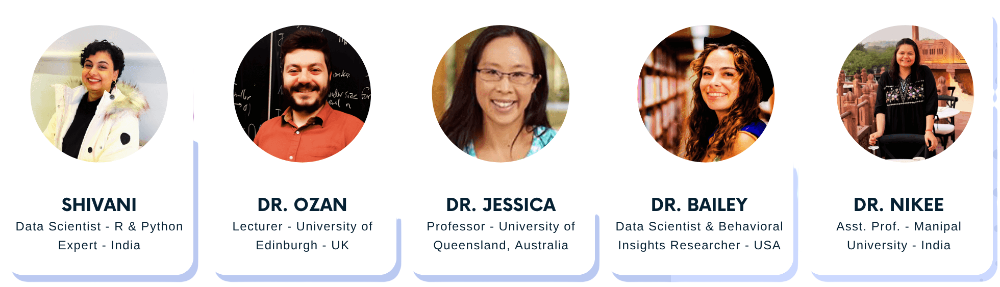

:::

---

## Past SARA Speakers {background-image="images/guest-speakers.png" background-size="contain" background-position="right"}

 
 

::: {.columns}

::: {.column width="50%"}

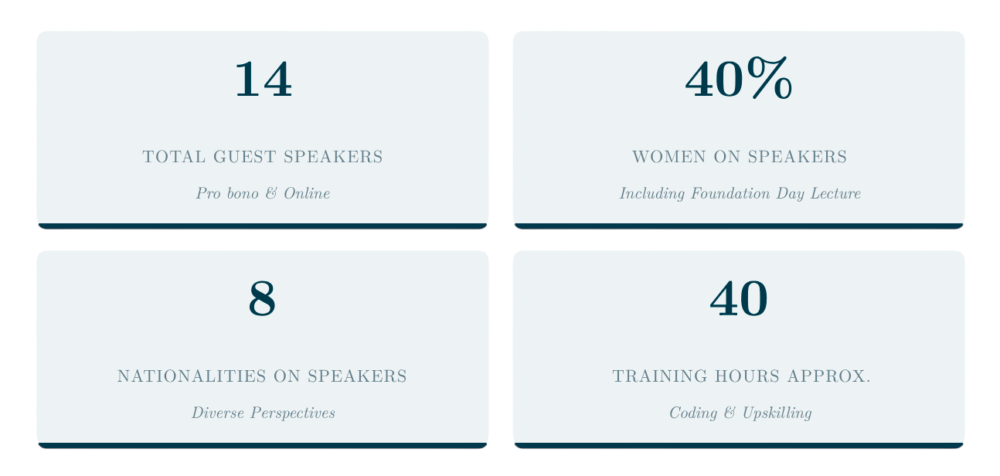{fig-align="left"}

:::

::: {.column}

:::

:::
---

## 3rd SARA Winter School {background-image="images/3sws.png" background-size="40%" background-position="100% 50%"}

> "Statistics using R" in 20-24 Nov 2026

::: {.columns}

::: {.nonincremental}

::: {.column width="60%"}

- Day 1: R, RStudio & descriptive statistics

- Day 2: Date Visualization

- Day 3: Probability & Sampling

- Day 4: Inferential Statistics Hypothesis testing

- Day 5: Correlation and Regression

:::
:::

::: {.column}

:::

:::

# SARA Bridge Education {background-image="images/sahu-notebook.png" background-size="27%" background-position="85% 50%" background-color="#0F766E"}

::: footer
<a href="https://unsplash.com/illustrations/a-cartoon-triangle-character-using-a-laptop-NolacJp8Xqg?utm_source=unsplash&utm_medium=referral&utm_content=creditCopyText">Illustration</a> by <a href="https://unsplash.com/@aditya_sahu_lab/illustrations?utm_source=unsplash&utm_medium=referral&utm_content=creditCopyText">Aditya Sahu</a> on <a href="https://unsplash.com/illustrations?utm_source=unsplash&utm_medium=referral&utm_content=creditCopyText">Unsplash</a>
:::

## SARA Bridge Courses {.centering}

 

:::: {.layout-grid}

::: {.col}

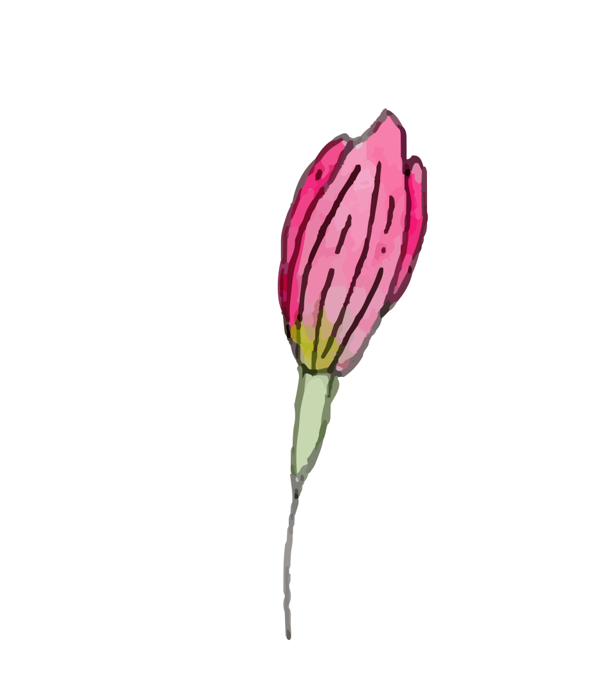{width="40%"}

### Level 1

6th to 8th class

:::

::: {.col}

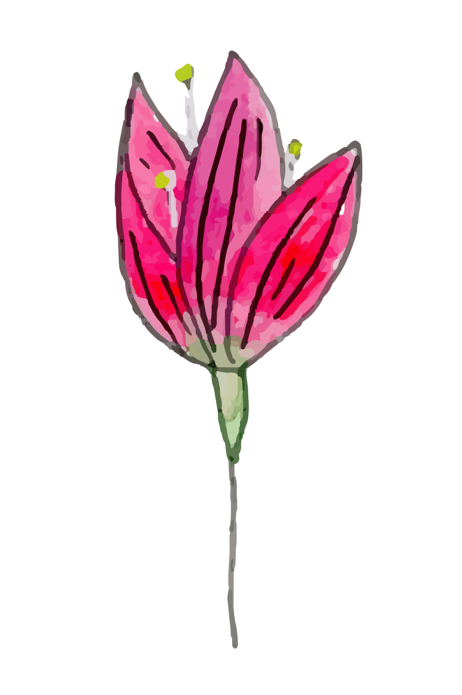{width="32%"}

### Level 2

9th to 10th class

:::

::: {.col}

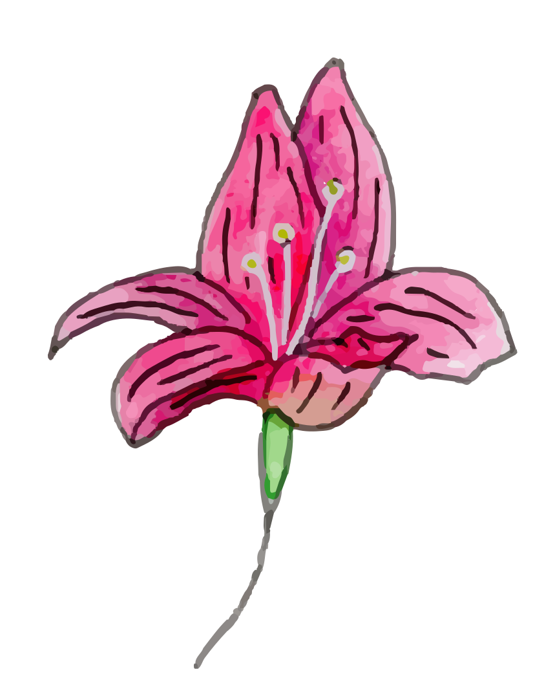{width="40%"}

### Level 3

11th & 12th class

::: 

::::

::: footer
<a href="https://unsplash.com/illustrations/various-pink-flower-illustrations-in-different-stages-sxFK4Yn-lu8?utm_source=unsplash&utm_medium=referral&utm_content=creditCopyText">Illustration</a> by <a href="https://unsplash.com/@liska_lissa/illustrations?utm_source=unsplash&utm_medium=referral&utm_content=creditCopyText">Viktoriya Lissachenko</a> on <a href="https://unsplash.com/illustrations?utm_source=unsplash&utm_medium=referral&utm_content=creditCopyText">Unsplash</a>
:::

## Level 1: Work in Progress {background-image="images/bridge-course.png" background-position="right" background-size="contain"}

 
 

- Free, online, open to all

- Volunteer to teach pro bono at SARA

[ Click to Register](https://forms.gle/cQJ5DYcFx2jHLeKi8)  

---

## SARA Book Club 

> 26/40 Books received for Bridge Course Level 1

 

::: {layout-ncol="2"}





:::

::: footer
[Click to donate books to SARA](https://sara-edu.netlify.app/book-club/books-donation/sara_book_donations)

:::

# SARA Finance {background-image="images/finance.png" background-size="27%" background-position="85% 45%" background-color="#0F766E"}

::: footer
<a href="https://unsplash.com/illustrations/a-cartoon-triangle-character-using-a-laptop-NolacJp8Xqg?utm_source=unsplash&utm_medium=referral&utm_content=creditCopyText">Illustration</a> by <a href="https://unsplash.com/@aditya_sahu_lab/illustrations?utm_source=unsplash&utm_medium=referral&utm_content=creditCopyText">Aditya Sahu</a> on <a href="https://unsplash.com/illustrations?utm_source=unsplash&utm_medium=referral&utm_content=creditCopyText">Unsplash</a>
:::

## SARA Education Trust

 
 

- SARA Trust registered in New Delhi on Date: `02 Mar 2024`

- Permanent Account Number (PAN) Card: `ABJTS0156P`

- Trust Bank Account: SBI Sonipat, HR

## Previous IT Returns {background-color="black"}

> ❤️ Community members are the main donors $\cdot$ 99% online transactions

::: {.centering}
::: {layout-ncol="2"}

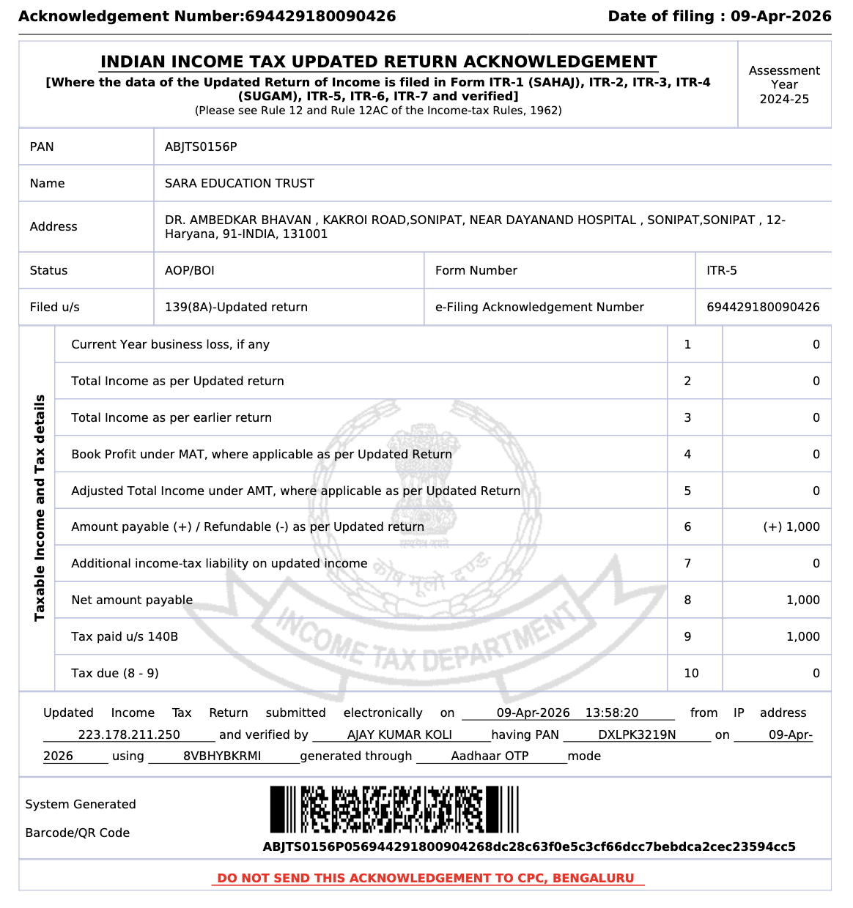{width="70%"}

{width="70%"}

:::
:::

## SARA Account {background-image="images/blankets.png" background-size="50%" background-position="109% 50%"}

> Apr-Sep 2026

 

::: {.columns}

::: {.column}

:::{.finance-table}
| Category | Amount |
|---|--------------|
| Amount carried from 2025-26   | [₹1,50,000]{.amount-positive} |
| Donations during Apr-Sep 2026 | [₹2,00,000]{.amount-positive}  |
| Expenses during Apr-Sep 2026  | [₹2,50,000]{.amount-negative}  |
| Current Balance   | ₹1,00,000  |
:::

::: {.aside}
- Dr. Ajay Kumar Koli's per month salary ₹15,000.
- On 02 July 2026, SARA's 12A & 80G Applications were submitted by a CA on the Income Tax department website.
:::

:::

::: {.column}

:::

:::

## Donate to SARA {background-image="images/upi-sara.png" background-position="right" background-size="contain"}

::: {.columns}

::: {.column}

> One rupee. One brick.

 

::: {.nonincremental}

- Account number: `42920911856`

- Acc. name: SARA Education Trust

- Bank name: State Bank of India

- IFSC code: `SBIN0000721`

:::

:::

::: {.column}

:::

:::

# Upcoming SARA Projects {background-image="images/future-projects.png" background-size="27%" background-position="85% 50%" background-color="#0F766E"}

::: footer
<a href="https://unsplash.com/illustrations/a-cartoon-triangle-character-using-a-laptop-NolacJp8Xqg?utm_source=unsplash&utm_medium=referral&utm_content=creditCopyText">Illustration</a> by <a href="https://unsplash.com/@aditya_sahu_lab/illustrations?utm_source=unsplash&utm_medium=referral&utm_content=creditCopyText">Aditya Sahu</a> on <a href="https://unsplash.com/illustrations?utm_source=unsplash&utm_medium=referral&utm_content=creditCopyText">Unsplash</a>
:::

##  Upcoming SARA Projects

::: {.panel-tabset}

## Sep 2027 Offline Level 1

> First Offline Batch of Level 1 (6-8 classes)

- 03 months residential level 1 course at SARA, Dr. Ambedkar Bhawan, Sonipat.

- 100 students (50 female) priority admission for marginal communities & women.

- Plan funds to provide accommodation and food for 100 days.

- Need pro bono teachers & slides.

## June 2028 Internships

 

- Data & research related summer & winter internships

- Need more planning how SARA can have its own project.

## 2029 Conference

> 3 Jan Mata Savitribai's Birth Anniversary 

- Inviting scholars to present papers.

- Inviting young students to interact with the scholars.

- Award budding scholars from marginalised communities.

:::

## SARA's own Space {background-image="images/oxford.png" background-size="contain" background-position="right" background-color="cream"}

 
 

- Land at least 500 Gaj (approx 5000 Sq foot) in Delhi NCR

- 1 auditorium for at least 100 students

- Two dormitories (each with 50 capacity beds)

- Guest rooms, meeting rooms, office rooms

- Mess with kitchen facility

# SARA Community {background-image="images/community.png" background-size="30%" background-position="80% 50%" background-color="#0F766E"}

::: footer
<a href="https://unsplash.com/illustrations/a-cartoon-triangle-character-using-a-laptop-NolacJp8Xqg?utm_source=unsplash&utm_medium=referral&utm_content=creditCopyText">Illustration</a> by <a href="https://unsplash.com/@aditya_sahu_lab/illustrations?utm_source=unsplash&utm_medium=referral&utm_content=creditCopyText">Aditya Sahu</a> on <a href="https://unsplash.com/illustrations?utm_source=unsplash&utm_medium=referral&utm_content=creditCopyText">Unsplash</a>
:::

## [The Ambedkar Educational Society Sonipat]{.r-fit-text}

[Mr. Satyawan Bhatia (ex-President) $\cdot$ Mr. Rajesh Kataria (President)]{.amount-negative}

 

::: {layout="[50, 10, 25]" layout-valign="center"}

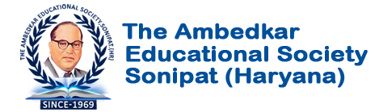



:::

::: footer
Working together Sep 2023 - Present
:::

## SARA Jai Bhim Circle {background-image="images/circle.png" background-position="90% 50%" background-size="35%"}

> Educate. Agitate. Organise

 
 

- Quarterly online open community meet-up.

- To share success and receive guidance.

::: footer
Thank you Mr. Diwakar for creating the logo of SARA Jai Bhim Circle.
:::

## SARA is similar but

 
 

::: {.centering}
::: {layout-ncol="3" layout-valign="bottom"}

  

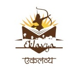{width="35%"}  

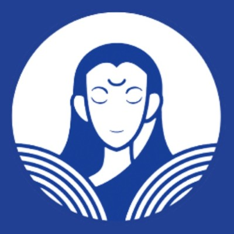{width="1.25in"}    

:::
:::

. . .

 

> [SARA's focus is coding & AI for Babasaheb's children.]{.r-fit-text} [But why?]{.rn-fragment .amount-negative}

## Coding is not [JUST]{.amount-negative} a Technical skill {background-color="black"}

. . .

> [algorithmic discrimination, data colonialism, data justice, exclusionary AI, automated inequality, ]{.r-fit-text .rn-fragment rn-color=gold}

. . .

::: {layout-ncol="3"}

:::

::: footer
Images from goodreads
:::

## SARA Social Media {background-image="images/whatsapp.jpeg" background-position="right" background-size="contain"}

> Pls follow & share

::: {.columns}

::: {.column width="60%" .r-fit-text}

[](https://twitter.com/sara_institute) Twitter with `1552` people 

[](https://www.youtube.com/@SARADataScience) YouTube with `+890` people

[](https://whatsapp.com/channel/0029Va4r7rGLCoWycMwThl2J) WhatsApp Channel with `+844` people

[](https://www.linkedin.com/company/sara-institute/) LinkedIn with `+600` people

[](https://www.facebook.com/profile.php?id=61564043738390) Facebook with `+97` people

[](https://bsky.app/profile/sarainstitute.bsky.social) Bluesky with with `+63` people

[](https://www.instagram.com/sara_data_sci/) Instagram with `+57` people

[](https://github.com/sara-edu) GitHub with `+16` people

:::

::: {.column}

:::

:::

::: {.aside}
updated on 25 Sept 2026
:::

## Contact SARA {background-image="images/sara-logo-medium.png" background-size="20%" background-position="90% 50%"}

::: {.columns }

::: {.column width="70%"}
::: {.r-fit-text}
** Address:** 
SARA Institute   
Dr. Ambedkar Bhavan, Near Dayanand Hospital            
Kakroi Road, Sonipat, Haryana - 131001, India       
Google Map Link: <https://maps.app.goo.gl/d9S6a3pEFNXhnJGN6>

 

** Phone:** +91 925 315 2024     
** Email:** [sara.institute.info@gmail.com](mailto:sara.institute.info@gmail.com)  
** Website:** <https://sara-edu.netlify.app/>

:::
:::

::: {.column width="25%" .center}
:::
:::

::: aside

[](https://bsky.app/profile/sarainstitute.bsky.social) &nbsp; [](https://github.com/sara-edu) &nbsp; [](https://www.instagram.com/sara_data_sci/) &nbsp; [](https://twitter.com/sara_institute) &nbsp; [](https://www.facebook.com/profile.php?id=61564043738390) &nbsp; [](https://www.youtube.com/@SARADataScience) &nbsp; [](https://www.linkedin.com/company/sara-institute/) &nbsp; [](https://whatsapp.com/channel/0029Va4r7rGLCoWycMwThl2J)

:::

# {background-image="images/bg-cities.png" background-opacity="15%" background-size="cover"}

::: centering
[Thank you!]{.theme-cursive style="font-size: 3em;"}

[*SARA Jai Bhim Circle*]{.amount-positive} IIIrd Quarter Meeting will be on Sun 03 Jan 2027
:::

::: footer
Slides are prepared with ❤️ using open-source tools [Positron](https://positron.posit.co/download.html) & [Quarto](https://quarto.org/) from [Posit](https://posit.co/)
:::

## Let's Discuss! 

1. [What else should be added to our Data School curriculum?]{.rn-fragment}

1. [Should SARA also approach organizations for sponsorships?]{.rn-fragment}

1. [Should Bridge Course classes be live-streamed on YouTube directly,  or held on Zoom first and uploaded to YouTube afterward?]{.rn-fragment}

1. [Would you be interested in teaching pro bono, or do you know someone who might be?]{.rn-fragment}

1. [Should SARA buy its own land to build a permanent space?]{.rn-fragment}

1. [What else should SARA be thinking about (as an organization)?]{.rn-fragment}
